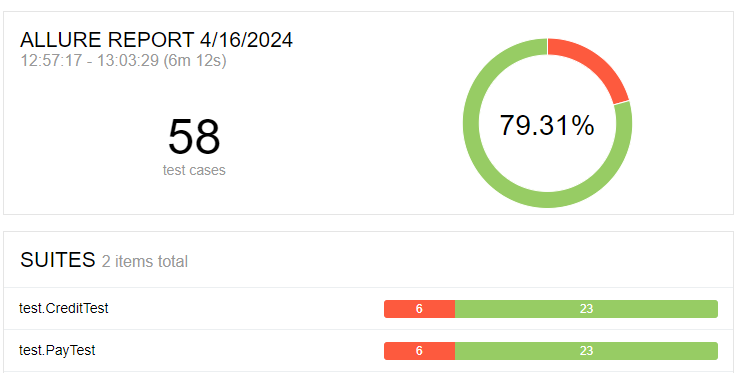

# Отчёт по итогам тестирования
## краткое описание
Было проведено тестирование приложения веб-сервиса, который предлагает купить тур по определённой цене двумя способами: 
- Обычная оплата по дебетовой карте
- Уникальная технология: выдача кредита по данным банковской карты

### количество тест-кейсов - 58
### 79,31 % успешных и 20,68 % не успешных тест-кейсов

## общие рекомендации
1. Разработать техническую документацию
2. Исправить баги для корректной работы